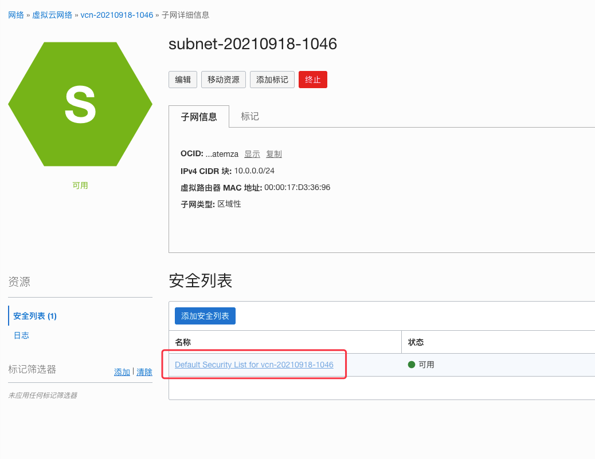

## 一些链接

- [SeAT GitHub](https://github.com/eveseat/seat)
- [SeAT Dcos](https://eveseat.github.io/docs)
- [Oracle Cloud](https://www.oracle.com/cn/cloud/free)
- [Docker](https://www.docker.com)
- [Docker Compose GitHub](https://github.com/docker/compose/)
- [EVE Developers](https://developers.eveonline.com)

---

## 准备工作

1. 一台能上网的电脑
2. 一个邮箱
3. 一个域名
4. 一张支持visa的"双币信用卡"（用于Oracle Cloud验证）

## 注册一个域名

省略

## 注册Oracle Cloud

> 注册个账号而已嘛，辣么多联盟管理软件都注册过，相信你们可以的

## 注册EVE开发者应用

1. 进入[EVE Developers](https://developers.eveonline.com) 网站，使用自己的游戏账号登录。


2. 创建应用


3. 查看`Client ID`和`Secret Key`


## 服务器

### 创建云服务器

登录Oracle Cloud后，切换到中文


开始创建VM


设置服务器信息


选择系统镜像


根据指引生成SSH key→[链接](https://docs.oracle.com/en-us/iaas/Content/Compute/Tasks/managingkeypairs.htm)

Linux/MacOS 进入`HOME/.ssh`目录下查看`id_rsa.pub`文件内容

```shell
cat ~/.ssh/id_rsa.pub
```
将输出内容粘贴进`SSH 密钥`输入框中


最后点击创建即可

#### 登录

### 服务器配置

> 开放80和443端口

依次点击进入



查看80和443端口是否开放


### 系统环境搭建

#### 安装pip（用于安装Docker Compose）

```shell
python3 -m pip install --upgrade pip setuptools wheel
```

#### 切换到root

```shell
sudo -i

# 给root用户设置密码
passwd
# 输入两次密码
```

#### 部署Docker

1. 删除原有Docker环境

```shell
yum remove docker \
                  docker-client \
                  docker-client-latest \
                  docker-common \
                  docker-latest \
                  docker-latest-logrotate \
                  docker-logrotate \
                  docker-engine
```

2. 添加Docker官方yum源

```shell
yum install -y yum-utils
```

```shell
yum-config-manager \
    --add-repo \
    https://download.docker.com/linux/centos/docker-ce.repo
```

3. 安装Docker引擎

```shell
yum install docker-ce docker-ce-cli containerd.io
```

4. 启动Docker

```shell
systemctl start docker
```

5. 给Docker添加开机自启动

```shell
systemctl enable docker
```

### 安装Docker Compose

```shell
pip install docker-compose
```

### 部署SeAT

使用一键部署脚本

```shell
bash <(curl -fsSL https://git.io/get-seat)
```

- 输入域名
- 输入二级域名
- 输入邮箱（用来注册免费的SSL证书，不需要手动注册）
- 输入`Client ID`
- 输入`Secret Key`

完成之后在浏览器输入域名即可，
如果一切正常的话，在浏览器会看到`Bad Gateway`的字样，
不要慌，等几分钟初始化完成即可。

> 最后的最后，如果实在撘不起来，也可以使用我的公共服务器
> [https://seat.eveonline.games/](https://seat.eveonline.games/)
